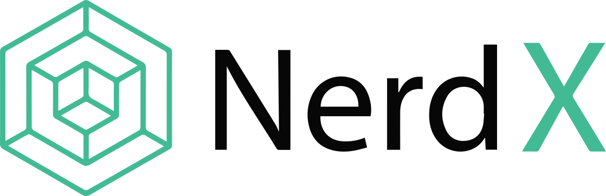

 

# NerdX - Decentralized Ethereum based exchange
You can have a look at this **demo video** to get a sense of how the project works. Click on the image to view the demo video.

*(Right now, it's working on Ropsten Testnet)*

You can also check out the [Live Demo](https://nerd-x.herokuapp.com/). The project supports only Metamask, for now. 

**NOTE: If the page fails to load, just wait a few seconds and reload it. It happens because the app is hosted on heroku and heroku's free version resets the app if nobody is using it for a certain period of time.** 

## About
**Note: This project was created as a portfolio projects for InSynk Studios and it we do not intend to monetize on it by launching on the mainnet.**

NerdX is a decentralized exchange which allows you to buy and sell the `NEX` token (NerdX token) in exchange for ether. `NEX` is an ERC20 token.

The exchange has the following features:
* Deposit Ether into the exchange
* Withdraw Ether from the exchange
* Deposit `NEX` into the exchange
* Withdraw `NEX` from the exchange
* Make `buy` and `sell` orders
* Fill `buy` and `sell` orders, from the Order book
* Graph view of the token price
* View all the trades that you have done
* View all the orders you have made
* Cancel a previously made, unfulfilled, order
* View all the trades that has been made yet

In order to use the exchange, you just need to login with your Metamask wallet, on the Ropsten network.

## Contribution

To contribute to this project, first you need to set it up, locally. Follow the tutorial below:

### Frontend
You need to install all the dependencies for this project's frontend. (I have used `npm` in this project, if you intend to use other package managers, make sure to delete the `package-lock.json`.)

Run `npm install`

Wait for the installation to get over, and try running the server with `npm run start`. 

Open [http://localhost:3000](http://localhost:3000) to view it in your browser.

The page will reload when you make changes.

### Backend
This project is a `truffle` project and has `truffle-config.js` as it's config file. 

So, in order to run the development server, you need to have `Ganache` installed which will act as a local blockchain. Having `Ganache` running, you need to compile and migrate the smart contracts onto `Ganache` using the following commands,

This command deploys the smart contract on the blockchain,
> truffle migrate --reset

Once that is done, you can run the Smart contract tests to it working,
> truffle test

If you want, you can add seed data to the exchange through the `seed-exchange.js` file. Just run the following command,

> truffle exec scripts/seed-exchange.js

This will help you generate data so that the exchange doesn't look empty in the browser.